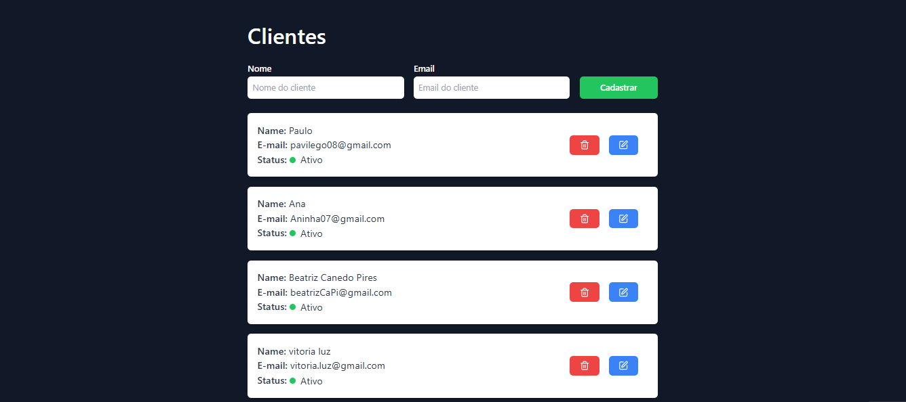

# Customer Management CRUD

## 📌 Sobre

Este projeto é um CRUD (Create, Read, Update, Delete) para gerenciamento de clientes, desenvolvido com ReactJS e TypeScript. Ele permite cadastrar, visualizar, atualizar e excluir clientes de forma intuitiva e eficiente.

## 🚀 Tecnologias
O projeto foi desenvolvido utilizando as seguintes tecnologias:

* ⚛️ ReactJS – Biblioteca JavaScript para construção de interfaces modernas e performáticas.
* 🏷 TypeScript – Superset do JavaScript que adiciona tipagem estática ao código.
* 🔄 Axios – Cliente HTTP para comunicação com a API.

## 🔗 API
Este projeto se comunica com um backend desenvolvido em Node.js (ou a tecnologia usada).
O código-fonte do backend está disponível no seguinte repositório:

🔗 Repositório do Backend: [Link do repositório](https://github.com/Vitorialuz229/api-crud-customers)

A API utilizada deve conter os seguintes endpoints:

* GET /customers - Retorna todos os clientes

* POST /customers - Adiciona um novo cliente

* PUT /customers/:id - Atualiza um cliente

* DELETE /customers?id={id} - Remove um cliente

## 🎨 Layout

💡 Desenvolvido com ❤️ por Vitória Luz
